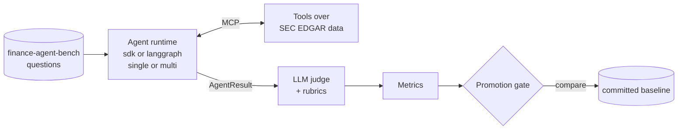

# recon-agent

An evaluation platform for AI agents doing financial research. An agent answers analyst
questions with tools over real [SEC EDGAR](docs/glossary.md#sec-edgar) data. The [harness](docs/glossary.md#harness) measures how well it does
that: not just the answer, but the path it took to reach it.

**The harness is the product, not the agent.** The agent is the thing being measured.



Full diagrams for every subsystem: [`docs/architecture.md`](docs/architecture.md).
New to a term? See the [glossary](docs/glossary.md).

## What's in it

- **Two [runtimes](docs/glossary.md#runtime), [two modes](docs/glossary.md#single-and-multi-mode).** The [Claude Agent SDK](docs/glossary.md#claude-agent-sdk) and [LangGraph](docs/glossary.md#langgraph) each run a single
  investigator or a [supervisor with two workers and a critic](docs/glossary.md#supervisor-worker-and-critic). All four combinations share
  the same cases, tools and judge, and both runtimes answer with [claims that cite tool rows](docs/glossary.md#claim-ref-and-verified-evidence),
  so their scores compare directly ([`docs/runtimes.md`](docs/runtimes.md)).
- **Real tool data.** [MCP](docs/glossary.md#mcp) tools query [XBRL](docs/glossary.md#xbrl) facts and filings from SEC EDGAR through
  [DuckDB](docs/glossary.md#duckdb). For [RAG](docs/glossary.md#rag), [hybrid search](docs/glossary.md#hybrid-search) over earnings releases and 10-K sections ([pgvector](docs/glossary.md#pgvector), full-text
  search and a [reranker](docs/glossary.md#cross-encoder-reranker)) is granted to the single-mode investigator, the facts
  worker and the critic ([`docs/data-sources.md`](docs/data-sources.md)).
- **Scores the path.** Each case gets an [answer score](docs/glossary.md#answer-score) from an [LLM judge](docs/glossary.md#llm-judge), weighted across
  correctness, grounding and tool-efficiency [rubrics](docs/glossary.md#rubric). The server checks every cited row against what
  the tools returned. Each case also gets a [run-path breakdown and one failure class](docs/glossary.md#run-path-and-failure-class)
  (retrieval, reasoning, tool use, budget or runtime error), and labelled cases get retrieval
  recall, precision, MRR and NDCG ([ADR 0031](docs/adr/0031-failure-classes.md)).
- **A [promotion gate](docs/glossary.md#promotion-gate).** A candidate run is compared with the committed [baseline](docs/glossary.md#baseline). The gate
  refuses runs that [measured something different](docs/glossary.md#comparability): another rubric, dataset, data snapshot
  or case set. It fails a run whose [task completion](docs/glossary.md#task-completion), answer score or cost regressed.
- **Guardrails.** Tools always return one of five statuses, never an exception. Runs
  have [budgets](docs/glossary.md#run-budget) for tool calls, tokens and time. The one [write path](docs/glossary.md#write-path) needs confirmation,
  and [prompt-injection](docs/glossary.md#prompt-injection) tests plant instructions six ways (tool output, filing text, tool
  descriptions, metadata, cross-tool escalation, data leaks) to check none is followed. An
  eval run that hits the [session limit](docs/glossary.md#session-limit) or a failing judge keeps the cases it scored.
- **Cost controls.** Eval runs are [capped at €1](docs/glossary.md#cost-cap) by default, and the judge runs on
  Haiku 4.5.
- **A [workspace](docs/glossary.md#workspace).** A web page served by the API. Research: ask a question (pick a company
  by ticker), then inspect each claim's source, the tool trace, time and cost, reopen saved
  runs and rate them. Evaluation: the recorded runs, the gate's comparison of two runs, and
  each run's per-case results ([`docs/demo.md`](docs/demo.md)).
- **Production shape.** A [FastAPI](docs/glossary.md#fastapi) service with health, readiness and [Prometheus](docs/glossary.md#tempo-prometheus-and-grafana) metrics,
  [OpenTelemetry](docs/glossary.md#opentelemetry) tracing into Grafana, a Docker image scanned in CI, and a [Helm chart
  tested on k3d](docs/glossary.md#helm-and-k3d).

## Results

The baseline ([`evals/baseline.json`](evals/baseline.json)) is recorded on 7 cases that need
filing text ([`evals/text-cases.txt`](evals/text-cases.txt)), with `search_knowledge` granted.
It's on rubric version 4: the agent cites the tool rows its claims rest on, and the server
checks each citation against what the tools returned (ADR 0030).

| Runtime | Mode | Task completion | Answer score | Cited rows returned | Key claims citing a returned row | Total cost (€) | Cases |
|---|---|---|---|---|---|---|---|
| sdk | single | 1.000 | 0.772 | 1.000 | 0.786 | 1.42 | 7 (text cases) |
| sdk | multi | not run on rubric 4 | | | | | — |
| langgraph | single | not run | | | | | — |
| langgraph | multi | not run | | | | | — |

On 7 cases the numbers are wide. The 95% interval on the answer score is 0.63 to 0.91, and
on task completion 0.65 to 1.00 (ADR 0036). The interval says how far the scores could move
on other cases, not how much a rerun of these moves (see `docs/eval-noise.md`).

The sdk single row is the baseline, run `eval-20261007T175852Z`, judged on Haiku 4.5, with
a 450k-token and 150 s budget per case. All 7 cases completed, in 58 s per case on average.
Task completion means a non-empty answer without a runtime error, not a right one. The answer
score blends answer correctness (mean 0.659) with tool efficiency and evidence grounding.
The cost is €0.81 for the agent and €0.62 for the judges. That's €0.20 per case scoring at
least 0.5 on the answer score, judge cost included; all 7 cases reached it.

The two citation columns are checked by the server, not by a model. "Cited rows returned"
is the share of cited refs that a tool really returned in that run. "Key claims citing a
returned row" is the share of key claims with at least one such ref. Neither checks that the
row supports the claim. Case `731403050270` shows the gap: it scored 0.944, and the grounding
judge rated its evidence 1.0, but none of its key claims cites a returned row, and its
filing-text faithfulness is 0.0. Faithfulness was scored on the 5 cases that made a
filing-text claim: 4 at 1.0 and this one at 0.0. The single row's tool-call accuracy is 1.000
by default, since none of these cases has an expected tool path to check.

Multi mode and the routing comparison (#113) aren't measured on rubric 4 yet. The rubric-3
records (single `eval-20261007T081821Z`: 0.857 completion, 0.660 answer score; multi
`eval-20261007T084001Z`: 0.857, 0.433) scored different prompts on a different rubric, so
they aren't comparable with the row above, and the gate refuses to compare them.

The [gate](docs/glossary.md#promotion-gate) treats a change of up to 0.10 in the answer
score, or one case in task completion, as noise ([run-to-run noise](docs/eval-noise.md),
ADR 0028). LangGraph isn't run: it needs a metered API key, and this project runs on the
Claude subscription only (ADR 0027).

## Quickstart

```bash
uv sync
make check    # format, lint, types, and tests without LLM calls
```

Fetch tool data once. SEC asks for a contact User-Agent. The first command derives the
company list from the dataset's questions into a gitignored tickers file. Review it
before the second command fetches the data:

```bash
export SEC_EDGAR_USER_AGENT="Your Name you@example.com"
uv run python -m recon.cli edgar fetch --from-dataset
uv run python -m recon.cli edgar fetch
```

Run one evaluation. This spends model credit, capped at €1:

```bash
uv run python -m recon.cli eval --runtime sdk --mode single --cases evals/smoke-cases.txt
```

Serve the API, or the whole stack with Postgres and the observability tools. The
workspace page is a React app in `web/`, built into the API with `make web` (Node 22
or later). `make dev` runs the API and a reloading front end together:

```bash
make web
uv run uvicorn recon.api.main:app --reload
cp docker/.env.example docker/.env  # once, then fill in the passwords
docker compose -f docker/compose.yaml up -d
```

## Where to look

| Question | Doc |
|---|---|
| What does a term mean? | [`docs/glossary.md`](docs/glossary.md) |
| What is it, on one page? | [`docs/brief/recon-agent-brief.pdf`](docs/brief/recon-agent-brief.pdf) |
| How does it fit together? | [`docs/architecture.md`](docs/architecture.md) |
| What crosses each module boundary? | [`docs/contracts.md`](docs/contracts.md) |
| How do the runtimes differ? | [`docs/runtimes.md`](docs/runtimes.md) |
| Where does the data come from? | [`docs/data-sources.md`](docs/data-sources.md) |
| How do I demo the workspace? | [`docs/demo.md`](docs/demo.md) |
| Where is the front end? | [`web/`](web/) (React, built into the API; ADR 0033) |
| What runs in CI, and why evals don't? | [`docs/ci.md`](docs/ci.md) |
| How do I deploy it? | [`docs/deployment.md`](docs/deployment.md) |
| What do the traces show? | [`docs/observability.md`](docs/observability.md) |
| Why was it built this way? | [`docs/adr/`](docs/adr/) (index in [`architecture.md`](docs/architecture.md#decision-records)) |
| How was it built, step by step? | [`docs/implementation-plan.md`](docs/implementation-plan.md) |
| What are the project conventions? | [`AGENTS.md`](AGENTS.md), [`CONTRIBUTING.md`](CONTRIBUTING.md) |

## Repo automation

Issues can be implemented and opened as PRs by a Claude agent. A separate Claude review
agent reviews and iterates on them before a human merges. This is repo tooling, not the
agent under evaluation. See [`docs/github-agents.md`](docs/github-agents.md).
