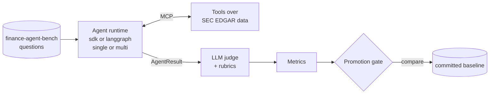

# recon-agent

An evaluation platform for AI agents doing financial research. An agent answers analyst
questions with tools over real [SEC EDGAR](docs/glossary.md#sec-edgar) data. The [harness](docs/glossary.md#harness) measures how well it does
that: not just the answer, but the path it took to reach it.

**The harness is the product, not the agent.** The agent is the thing being measured.



Full diagrams for every subsystem: [`docs/architecture.md`](docs/architecture.md).
New to a term? See the [glossary](docs/glossary.md).

## What's in it

- **Two [runtimes](docs/glossary.md#runtime), [two modes](docs/glossary.md#single-and-multi-mode).** The [Claude Agent SDK](docs/glossary.md#claude-agent-sdk) and [LangGraph](docs/glossary.md#langgraph) each run a single
  investigator or a [supervisor with two workers and a critic](docs/glossary.md#supervisor-worker-and-critic). All four combinations share
  the same cases, tools and judge, so their scores compare directly
  ([`docs/runtimes.md`](docs/runtimes.md)).
- **Real tool data.** [MCP](docs/glossary.md#mcp) tools query [XBRL](docs/glossary.md#xbrl) facts and filings from SEC EDGAR through
  [DuckDB](docs/glossary.md#duckdb). For [RAG](docs/glossary.md#rag), [hybrid search](docs/glossary.md#hybrid-search) over earnings releases and 10-K sections ([pgvector](docs/glossary.md#pgvector), full-text
  search and a [reranker](docs/glossary.md#cross-encoder-reranker)) is built but not yet granted to any agent role
  ([`docs/data-sources.md`](docs/data-sources.md)).
- **Scores the path.** Each case gets an [answer score](docs/glossary.md#answer-score) from an [LLM judge](docs/glossary.md#llm-judge), weighted across
  correctness, grounding and tool-efficiency [rubrics](docs/glossary.md#rubric). It also gets [tool-call accuracy](docs/glossary.md#tool-call-accuracy),
  the share of tool calls that returned a usable result.
- **A [promotion gate](docs/glossary.md#promotion-gate).** A candidate run is compared with the committed [baseline](docs/glossary.md#baseline). The gate
  refuses runs that [measured something different](docs/glossary.md#comparability): another rubric, dataset, data snapshot
  or case set. It fails a run whose [task completion](docs/glossary.md#task-completion), answer score or cost regressed.
- **Guardrails.** Tools always return one of five statuses, never an exception. Runs
  have [budgets](docs/glossary.md#run-budget) for tool calls, tokens and time. The one [write path](docs/glossary.md#write-path) needs confirmation,
  and [prompt-injection](docs/glossary.md#prompt-injection) tests check it's never triggered by tool data.
- **Cost controls.** Eval runs are [capped at €1](docs/glossary.md#cost-cap) by default, and the judge runs on
  Haiku 4.5.
- **Production shape.** A [FastAPI](docs/glossary.md#fastapi) service with health, readiness and [Prometheus](docs/glossary.md#tempo-prometheus-and-grafana) metrics,
  [OpenTelemetry](docs/glossary.md#opentelemetry) tracing into Grafana, a Docker image scanned in CI, and a [Helm chart
  tested on k3d](docs/glossary.md#helm-and-k3d).

## Results

The baseline ([`evals/baseline.json`](evals/baseline.json)) is recorded on 7 cases that need
filing text ([`evals/text-cases.txt`](evals/text-cases.txt)), with `search_knowledge` granted.

| Runtime | Mode | Task completion | Answer score | Tool-call accuracy | Total cost (€) | Cases |
|---|---|---|---|---|---|---|
| sdk | single | 0.857 | 0.660 | 1.000 | 1.33 | 7 (text cases) |
| sdk | multi | 0.857 | 0.433 | 0.897 | 1.43¹ | 7 (text cases) |
| langgraph | single | not run | not run | not run | not run | — |
| langgraph | multi | not run | not run | not run | not run | — |

The sdk single row is the baseline, run `eval-20261007T081821Z`, judged on Haiku 4.5, with
a 450k-token and 150 s budget per case. Its one incomplete case used 483k tokens and was
still judged. The sdk multi row is run `eval-20261007T084001Z`, a record, not a baseline,
with a 240 s budget. Its one incomplete case hit a worker's 8-turn limit. ¹That case
recorded €0.00, because a run that errors reports no cost, so multi's real cost is higher.
The same case cost €0.50 in single mode. The single row's tool-call accuracy is 1.000 by
default, since none of these cases has an expected tool path to check.

The [gate](docs/glossary.md#promotion-gate) treats a change of up to 0.10 in the answer
score, or one case in task completion, as noise ([run-to-run noise](docs/eval-noise.md),
ADR 0028). Against the single baseline it rates multi mode worse on the answer score,
beyond the band even without the case multi didn't finish. That compares two modes and
model configs on the same cases. It also rates cost the same, but multi's cost is
understated (¹). Earlier baselines ran with other prompts, budgets or tool
data, so their scores aren't comparable with these rows. LangGraph isn't run: it needs a
metered API key, and this project runs on the Claude subscription only (ADR 0027).

## Quickstart

```bash
uv sync
make check    # format, lint, types, and tests without LLM calls
```

Fetch tool data once. SEC asks for a contact User-Agent. The first command derives the
company list from the dataset's questions into a gitignored tickers file. Review it
before the second command fetches the data:

```bash
export SEC_EDGAR_USER_AGENT="Your Name you@example.com"
uv run python -m recon.cli edgar fetch --from-dataset
uv run python -m recon.cli edgar fetch
```

Run one evaluation. This spends model credit, capped at €1:

```bash
uv run python -m recon.cli eval --runtime sdk --mode single --cases evals/smoke-cases.txt
```

Serve the API, or the whole stack with Postgres and the observability tools:

```bash
uv run uvicorn recon.api.main:app --reload
cp docker/.env.example docker/.env  # once, then fill in the passwords
docker compose -f docker/compose.yaml up -d
```

## Where to look

| Question | Doc |
|---|---|
| What does a term mean? | [`docs/glossary.md`](docs/glossary.md) |
| How does it fit together? | [`docs/architecture.md`](docs/architecture.md) |
| What crosses each module boundary? | [`docs/contracts.md`](docs/contracts.md) |
| How do the runtimes differ? | [`docs/runtimes.md`](docs/runtimes.md) |
| Where does the data come from? | [`docs/data-sources.md`](docs/data-sources.md) |
| What runs in CI, and why evals don't? | [`docs/ci.md`](docs/ci.md) |
| How do I deploy it? | [`docs/deployment.md`](docs/deployment.md) |
| What do the traces show? | [`docs/observability.md`](docs/observability.md) |
| Why was it built this way? | [`docs/adr/`](docs/adr/) (index in [`architecture.md`](docs/architecture.md#decision-records)) |
| How was it built, step by step? | [`docs/implementation-plan.md`](docs/implementation-plan.md) |
| What are the project conventions? | [`AGENTS.md`](AGENTS.md), [`CONTRIBUTING.md`](CONTRIBUTING.md) |

## Repo automation

Issues can be implemented and opened as PRs by a Claude agent. A separate Claude review
agent reviews and iterates on them before a human merges. This is repo tooling, not the
agent under evaluation. See [`docs/github-agents.md`](docs/github-agents.md).
