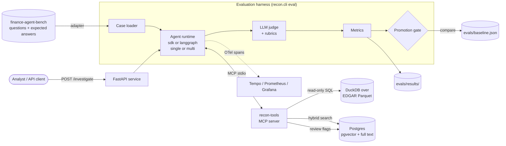
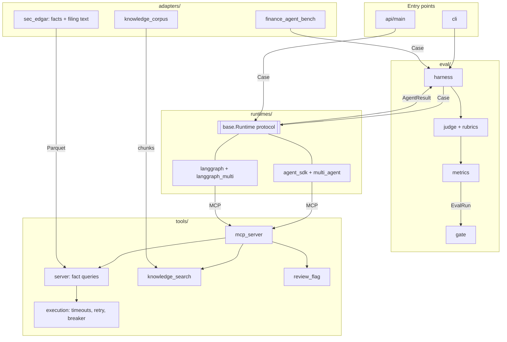
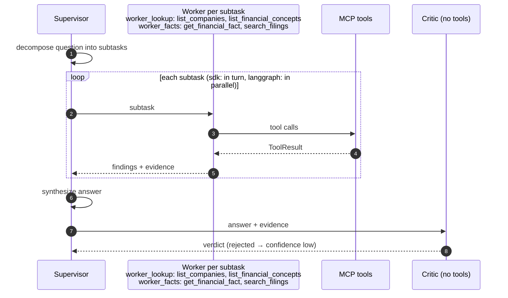
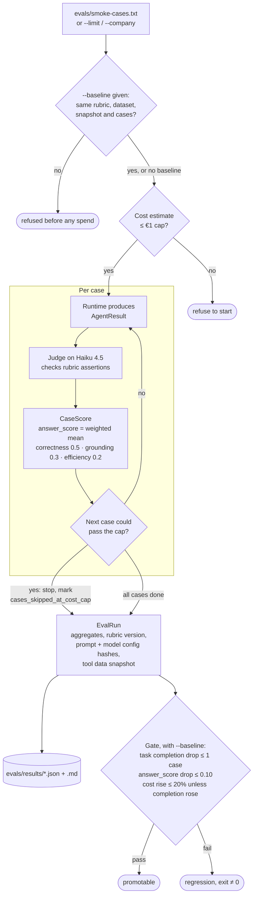
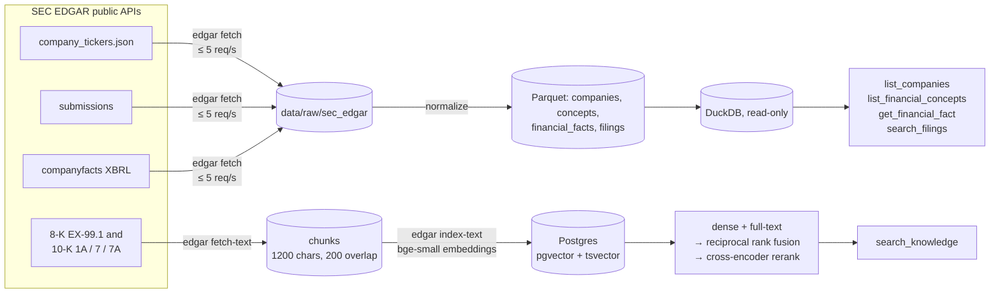
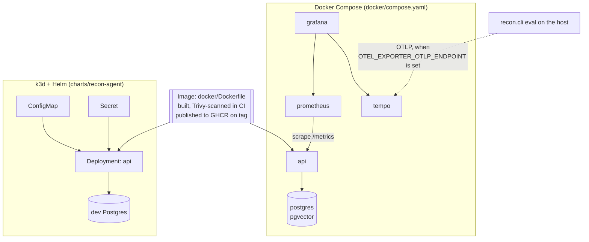

# Architecture

How the pieces of recon-agent fit together. Each section has a diagram and links to the
doc or ADR that holds the detail. Module boundaries are defined in
[`contracts.md`](contracts.md). This page describes them, it doesn't redefine them. Terms are explained in the
[glossary](glossary.md).

## System context

An analyst question goes to an agent [runtime](glossary.md#runtime). The runtime calls [MCP](glossary.md#mcp) tools that read [SEC
EDGAR](glossary.md#sec-edgar) data. The evaluation [harness](glossary.md#harness) scores both the answer and the path the agent took,
then [gates](glossary.md#promotion-gate) the result against a committed [baseline](glossary.md#baseline).

**The harness is the product, not the agent.** The agent is the thing being measured.
Four runtime/mode combinations run against the same cases, tools and judge, so their
scores are comparable.

## Module map

Every arrow below crosses a boundary typed by a Pydantic [contract](glossary.md#contract) in
[`src/recon/contracts.py`](../src/recon/contracts.py).

| Boundary | Model | Contract section |
|---|---|---|
| Dataset → harness | `Case` | §1 |
| Tool → agent | `ToolResult`, always one of five statuses, never an exception | §3 |
| Runtime → harness / API | `AgentResult`, including every `ToolCall`, tokens and cost | §4 |
| Write path | `ReviewFlag`, `ReviewFlagResult` | §6 |
| Harness → gate | `CaseScore`, `EvalRun` | §7, §9 |

Two stores, deliberately separate. [DuckDB](glossary.md#duckdb) serves read-only analytics to the tools.
Postgres holds everything with concurrent writers: LangGraph checkpoints, review flags
and pgvector embeddings.

## Agent runs

### Single mode

One investigator gets four read tools (`list_companies`, `list_financial_concepts`,
`get_financial_fact`, `search_filings`) plus `flag_case_for_review`, and answers with a
structured `answer`, `evidence` and `confidence`. [Budgets](glossary.md#run-budget) in
[`config/models.yaml`](../config/models.yaml) cap each run at 30 tool calls, 450k tokens
and 150 seconds (300 in multi mode). A breach ends the run with a partial `AgentResult` instead of an
exception ([ADR 0009](adr/0009-tool-reliability-and-run-budgets.md)).

### Multi mode

A supervisor decomposes the question into at most four subtasks, each for one of two
[workers](glossary.md#supervisor-worker-and-critic) with disjoint tool sets. It synthesizes their findings into an answer, and a
critic checks that answer against the evidence. Tool restriction is structural. Each
role's allowed tools come from [`config/roles.yaml`](../config/roles.yaml), not from its
prompt.

The runtimes share this flow but differ in how they run it and where a review flag
happens.

| | `sdk` | `langgraph` |
|---|---|---|
| Orchestration | One Claude Agent SDK `query()` per step: decompose, each subtask, synthesize, critic. Workers run one after another | A `StateGraph`: `decompose` → `Send` to workers in parallel → `synthesize` → `critic` → `confirm_flag` |
| Review flag | The supervisor calls `flag_case_for_review` itself, during decompose or synthesize | The supervisor sets `flag_reason`. The `confirm_flag` node then writes the flag in Python, after the critic |
| [Human-in-the-loop](glossary.md#human-in-the-loop) | None. The supervisor confirms its own flag | `interrupt()` in `confirm_flag`, resumed with the human's decision |
| [Checkpoints](glossary.md#checkpoint) | None | `AsyncPostgresSaver`, or `InMemorySaver` without `DATABASE_URL` |
| Billing | Agent SDK subscription credit | Metered API key in `RECON_ANTHROPIC_API_KEY` (ADR 0027) |

Full comparison: [`runtimes.md`](runtimes.md). Why four calls instead of SDK subagents:
[ADR 0007](adr/0007-multi-agent-orchestration.md).

### The write path

`flag_case_for_review` is the only write. As a tool, only the single-mode investigator
and the sdk supervisor have it. An optional dry run returns `would_write`
with a preview. An unconfirmed call returns `confirmation_required` and a
`preview_token`. Only a call that passes the token back with `confirmed` returns
`created`. In the sdk runtime and in langgraph single mode, the agent answers the
confirmation itself. Only langgraph multi mode pauses for a human. An [idempotency key](glossary.md#write-path) makes a
retried write return `already_exists` instead of a duplicate row
([ADR 0008](adr/0008-review-flag-write-path.md)). Deterministic safety graders in
[`safety_eval.py`](../src/recon/safety_eval.py) check that a write followed this protocol
and that [injected instructions](glossary.md#prompt-injection) in tool data never trigger one.

## Evaluation pipeline

What each piece guards against:

- **Path, not just answer.** The [judge](glossary.md#llm-judge)'s `tool_efficiency` [rubric](glossary.md#rubric) scores the path the
  agent took. Each `CaseScore` also records tool-call accuracy, the share of calls that
  returned a usable status. A tool-path match exists too, but finance-agent-bench sets no
  expected path, so it's N/A for every current case.
- **[Comparability](glossary.md#comparability).** The gate refuses a run whose rubric version, dataset, tool data
  snapshot or case set differs from the baseline's, or that stopped at its cost cap
  ([ADR 0018](adr/0018-run-comparability-in-the-gate.md)). The CLI checks this before
  the run starts.
- **Cost.** A run won't start above its estimate and stops before a case that could pass
  the cap ([ADR 0021](adr/0021-eval-cost-controls.md)).
- **Drift in CI.** Evals need model credit, so they run locally and their results are
  committed. CI checks that `prompts/` still matches the baseline's prompt hashes, and that the
  baseline clears the minimums in [`config/thresholds.yaml`](../config/thresholds.yaml).

## Tool data

Nothing filed after [`filed_cutoff`](glossary.md#snapshot-and-cutoff) in [`config/sec_edgar.yaml`](../config/sec_edgar.yaml)
is kept, so the tools can't see data newer than the questions. Everything under `data/`
is gitignored. `search_knowledge`, the [RAG](glossary.md#rag) tool, is granted to the single-mode investigator, the
facts worker and the critic (`config/roles.yaml`), with the baseline recorded on the text cases
([ADR 0025](adr/0025-retrieval-over-filing-text.md)). Sources and licensing:
[`data-sources.md`](data-sources.md).

## Deployment and observability

The API serves `POST /investigate`, `/healthz`, `/readyz` and `/metrics`, plus a small
static UI. [Spans](glossary.md#opentelemetry) follow the OpenTelemetry GenAI conventions: `eval.run` → `eval.case` →
`invoke_agent` → `execute_tool <tool>`, with the judge call beside it
([`observability.md`](observability.md)). Deployment detail, including what changes for a
managed cluster: [`deployment.md`](deployment.md).

## Repo automation

Issues can be implemented and opened as PRs by a Claude agent. A separate Claude review
agent reviews them, for at most three rounds, and a human always merges. This is repo
tooling, not the agent under evaluation. See [`github-agents.md`](github-agents.md).

## Decision records

| ADR | Decision |
|---|---|
| [0001](adr/0001-review-loop-human-escalation.md) | Review loop escalates human-only decisions to a human |
| [0002](adr/0002-api-error-code-semantics.md) | API returns 400 for schema-invalid input, 422 for valid input it can't process |
| [0003](adr/0003-api-service-dependencies.md) | FastAPI, uvicorn, prometheus-client and asyncpg approved |
| [0004](adr/0004-review-loop-actor-identity.md) | Review loop trusts `github-actions[bot]` alongside `claude[bot]` |
| [0005](adr/0005-api-timeout-cancellation-deferred.md) | Real cancellation of timed-out runs deferred |
| [0006](adr/0006-api-timeout-cancellation-fixed.md) | Timed-out `/investigate` runs are cancellable |
| [0007](adr/0007-multi-agent-orchestration.md) | Multi-agent: separate `query()` calls, client-side tool restriction |
| [0008](adr/0008-review-flag-write-path.md) | Review-flag write path: result shape, confirmation, schema bootstrap |
| [0009](adr/0009-tool-reliability-and-run-budgets.md) | Tool retries, circuit breaker and per-run budgets |
| [0010](adr/0010-langgraph-runtime.md) | LangGraph runtime: model access, MCP bridge, tool restriction, cost |
| [0011](adr/0011-container-base-image-and-size.md) | Container base image and full dependency set |
| [0012](adr/0012-dev-postgres-bundled-in-helm-chart.md) | Dev-only Postgres bundled in the Helm chart |
| [0013](adr/0013-judge-answers-despite-runtime-error.md) | Judge any non-empty answer, keep task completion strict |
| [0014](adr/0014-weighted-answer-score.md) | `answer_score` is the weighted mean across rubric dimensions |
| [0015](adr/0015-sec-edgar-fact-derivation.md) | SEC EDGAR company list, cutoff and fact derivation |
| [0016](adr/0016-isolated-agent-sdk-sessions.md) | Every Agent SDK session is isolated from the host machine |
| [0017](adr/0017-claude-code-project-setup.md) | Claude Code setup: hooks enforce hard rules, the rest loads on demand |
| [0018](adr/0018-run-comparability-in-the-gate.md) | The gate refuses runs that don't measure the same thing |
| [0019](adr/0019-image-scan.md) | How CI scans the image |
| [0020](adr/0020-company-names-allowed.md) | Company names may appear in the repo |
| [0021](adr/0021-eval-cost-controls.md) | Eval cost controls: Haiku judge, €1 cap |
| [0022](adr/0022-first-baseline-and-thresholds.md) | The first baseline and its thresholds |
| [0023](adr/0023-tracing-at-the-harness-boundary.md) | Tracing at the harness boundary |
| [0024](adr/0024-blocking-only-change-requests.md) | The review bot requests changes only for blocking findings |
| [0025](adr/0025-retrieval-over-filing-text.md) | Retrieval over SEC filing text |
| [0026](adr/0026-faithfulness-by-replaying-searches.md) | Faithfulness by replaying searches |
| [0027](adr/0027-langgraph-api-key-in-its-own-variable.md) | The LangGraph API key lives in its own variable |
| [0028](adr/0028-gate-noise-band.md) | The gate allows for measured run-to-run noise |
| [0029](adr/0029-route-decompose-to-a-local-model.md) | Route multi mode's decompose step to a local model |
| [0030](adr/0030-claims-cite-tool-rows-by-ref.md) | Claims cite tool rows by ref, and the server checks them |
| [0031](adr/0031-failure-classes.md) | One failure class per case, checked in a fixed order |
| [0032](adr/0032-prompt-check-pins-only-prompts-the-baseline-read.md) | The prompt check pins only the prompts the baseline read |
| [0033](adr/0033-react-front-end-built-into-the-api.md) | A React front end, built into the API image |
| [0034](adr/0034-numeric-claim-verification.md) | Numeric claims are verified by recomputation, against labelled claims |
| [0035](adr/0035-verification-report-and-claim-gate.md) | A verification report, a /verify endpoint and a claim check in the gate |
| [0036](adr/0036-intervals-and-the-noise-rule.md) | Intervals report uncertainty; the gate's noise band stays the owner's |
| [0037](adr/0037-architecture-view-as-a-tab.md) | The architecture page is a tab, written from what exists |
| [0038](adr/0038-verify-claims-by-replaying-fact-calls.md) | The harness verifies claims by replaying fact calls |
| [0039](adr/0039-claim-gate-fails-when-nothing-is-checkable.md) | The claim gate fails a candidate it can't check |
| [0040](adr/0040-structured-claim-figures.md) | Claims can state their figure as data |
