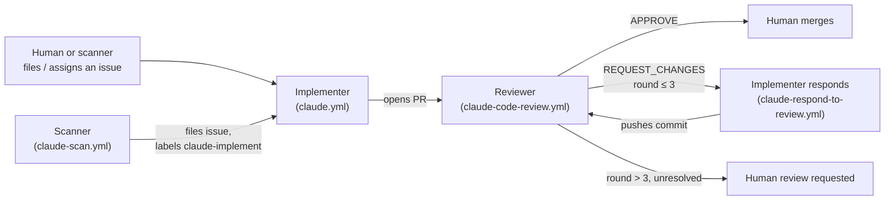

# GitHub agents

Four [Claude Code GitHub Actions](https://github.com/anthropics/claude-code-action)
maintain this repository: they turn issues into PRs, review PRs, and iterate with
each other before a human merges. This is separate from — and should not be
confused with — the investigator agent this repo evaluates (`src/recon/runtimes/`).
Everything on this page is repo tooling, not product code.

## Workflows

| File | Trigger | Role |
| --- | --- | --- |
| `.github/workflows/claude.yml` | `@claude` mention on an issue/PR comment; issue assigned to `claude`; issue labeled `claude-implement` | **Implementer.** Reads the issue, writes the fix, pushes a branch, opens a PR. |
| `.github/workflows/claude-scan.yml` | Weekly cron (Mondays 06:00 UTC) + manual `workflow_dispatch` | **Scanner.** Looks for concrete bugs/TODOs/tech debt, dedupes against open issues, files up to 5 new ones per run. Labels safely-fixable ones `claude-implement`. |
| `.github/workflows/claude-code-review.yml` | PR opened / synchronized / reopened / marked ready for review | **Reviewer.** Reads the diff, submits a formal GitHub review (`APPROVE` / `REQUEST_CHANGES` / `COMMENT`) covering correctness and design tradeoffs. |
| `.github/workflows/claude-respond-to-review.yml` | A review on a Claude-authored PR is submitted with `REQUEST_CHANGES` | **Implementer, again.** Reads the review, fixes what it agrees with, argues back on what it doesn't, pushes a new commit. |

## The loop

A PR does not merge itself at any point — see [Where a human steps in](#where-a-human-steps-in).

## Guardrails

- **Round cap.** The reviewer counts how many `REQUEST_CHANGES` reviews it has
  already submitted on a PR. After round 3, it stops requesting changes — it
  submits a `COMMENT`-type review summarizing what's unresolved and says
  explicitly that a human is needed. This bounds the implement/review exchange;
  it does not run forever.
- **Formal review state, not just comments.** The reviewer uses
  `mcp__github__create_pending_pull_request_review` /
  `submit_pending_pull_request_review` so `REQUEST_CHANGES` vs `APPROVE` is a
  real, queryable GitHub state (and so the round count above is reliable). The
  packaged `code-review` plugin skill isn't used here because it skips PRs it
  already commented on, which would break a multi-round loop after round 1.
- **`allowed_bots: "claude[bot]"`.** Both the reviewer and the responder allow
  this specific bot actor to trigger them, since the loop's own events (a
  review submission, a fix-commit push) are bot-authored and would otherwise
  be rejected by the action's default human-actor check — a deliberate
  anti-loop guard the action normally applies to *every* bot.
- **Write-access check.** Anyone triggering `@claude` via a comment, assignment,
  or label needs write access to the repo (the action's default check) — this
  isn't a public-facing surface.

## Where a human steps in

- **Deciding what gets worked on.** The scanner only files issues; it never
  assigns or labels them for implementation unless it judged the fix safe
  enough itself. Filing an issue and assigning it to `claude` (or applying
  `claude-implement`) is otherwise a human action.
- **Breaking ties.** After 3 review rounds without resolution, the loop stops
  itself and hands the PR back with a comment explaining what's still
  unresolved.
- **Merging.** No workflow merges a PR. `APPROVE` from the reviewer is a
  signal, not a merge — a human always clicks merge.
- **Adjusting the setup.** Scan cadence (`claude-scan.yml`'s cron), the round
  cap, and the trigger labels/usernames above are config values in these
  workflow files, not something the agents change about themselves.

## Setup

- Requires the `CLAUDE_CODE_OAUTH_TOKEN` repo secret and the
  [Claude GitHub App](https://github.com/apps/claude) installed with Contents,
  Issues, and Pull requests write access.
- Requires the `claude-implement` label to exist on the repo (created once;
  see the workflows above for where it's used).
- If `assignee_trigger: "claude"` or `allowed_bots: "claude[bot]"` don't match
  what the installed GitHub App actually registers as, the corresponding
  trigger silently won't fire — check the Actions log for the real actor
  login if a step in the loop doesn't trigger as expected.
